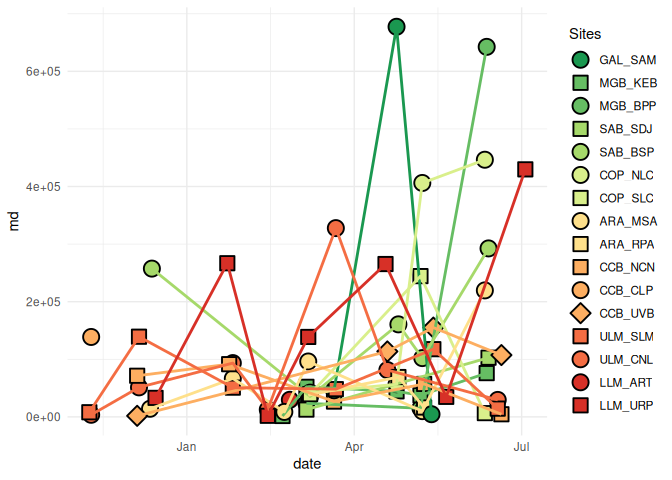

pmrs_data_setup_for_shiny
================
Texas A&M University-Corpus Christi

``` r
data <- readRDS(here::here("data","derived","clean_data.RDS"))
```

# Adjust “data” for graphing

Take out IND data, doesn’t add anything

``` r
data <- data %>%
  filter(!sample_site == "IND")
```

Filter out outliers to look at later

``` r
data <- data %>%
  filter(!tube_id == "JAN_UVB_14")
```

Add a full name of bay for graphing purposes

``` r
data <- data %>%
  mutate(bay_full_name = case_when(
    bay == "GAL" ~ "Galveston Bay", 
    bay == "COP" ~ "Copano Bay", 
    bay == "ARA" ~ "Aransas Bay",
    bay == "ULM" ~ "Upper Laguna Madre", 
    bay == "CCB" ~ "Corpus Christi Bay",
    bay == "SAB" ~ "San Antonio Bay",
    bay == "MGB" ~ "Matagorda Bay",
    bay == "LLM" ~ "Lower Laguna Madre"
  ))
```

Arrange data so latitude is descending

``` r
data <- data %>%
  arrange(desc(latitude))
```

# Assign site codes (each site assigned a 1, 2, or 3)

``` r
data <-data %>%
  mutate(site_code = case_when(
    sample_site == "MSA" ~ 1,
    sample_site == "RPA" ~ 2,
    sample_site == "CLP" ~ 1,
    sample_site == "NCN" ~ 2,
    sample_site == "UVB" ~ 3,
    sample_site == "NLC" ~ 1,
    sample_site == "SLC" ~ 2,
    sample_site == "SAM" ~ 1,
    sample_site == "ART" ~ 1,
    sample_site == "URP" ~ 2, 
    sample_site == "BPP" ~ 1,
    sample_site == "KEB" ~ 2,
    sample_site == "BSP" ~ 1,
    sample_site == "SDJ" ~ 2,
    sample_site == "CNL" ~ 1,
    sample_site == "SLM" ~ 2
  ))
```

# Combine bay and sample site

``` r
data <- data %>%
  mutate(key = paste(bay,sample_site,sep = "_")) 
```

# Make a color for each bay and add it to data

``` r
bay_colors <- data %>%
  select(bay,latitude) %>%
  unique() %>%
  arrange(desc(latitude)) %>%
  select(bay) %>%
  unique() %>%
  mutate(color = rev(brewer.pal(8, "RdYlGn")))

data <- data %>%
  left_join(.,bay_colors, by = "bay")
```

# Make a shape for each site and add it to data

``` r
data <- data %>%
  mutate(shape = if_else(site_code == 1, 21, NA)) %>%
  mutate(shape = if_else(site_code == 2, 22, shape)) %>%
  mutate(shape = if_else(site_code == 3, 23, shape))
```

# Data for legend

``` r
legend <- data %>%
  group_by(bay, key,shape,color,latitude) %>%
  summarise(n=n()) %>%
  arrange(desc(latitude))
```

``` r
fec <- data %>%
  filter(sex =="F") %>%
  group_by(sample_site,latitude,date,bay,color,key,site_code,shape) %>%
  summarise(md=median(wt_adj_fec,na.rm = TRUE)) %>%
  mutate(latitude = as.numeric(latitude)) %>%
  ungroup()
```

# Test set up

``` r
ggplot(fec, aes(x = date , y = md, 
                fill= fct_reorder(key,latitude, .desc = TRUE),
                shape = fct_reorder(key,latitude, .desc = TRUE),
                color = fct_reorder(bay,latitude, .desc = TRUE))) +
  geom_point(size = 5, stroke = 1, color = "black") + 
  geom_line(linewidth = 1) +
  scale_color_manual(values = rev(brewer.pal(8, "RdYlGn")),guide = "none") +
  scale_fill_manual(name = "Sites",
                     labels = legend$key,
                     values = legend$color) + 
  scale_shape_manual(name = "Sites",
                     labels = legend$key,
                     values = legend$shape) +
  theme_minimal()
```

<!-- -->

# Aggregated data for ggplot

## Weight adjusted fecundity (mean)

``` r
fec <- data %>%
  filter(sex =="F") %>%
  group_by(sample_site,latitude,date,bay,color,key,site_code,shape) %>%
  summarise(md=mean(wt_adj_fec,na.rm = TRUE)) %>%
  mutate(latitude = as.numeric(latitude)) %>%
  ungroup()
```

## Number of females

``` r
fem <- data %>%
  filter(sex =="F") %>%
  group_by(sample_site,latitude,date,bay,color,key,site_code,shape) %>%
  summarise(n=n()) %>%
  mutate(latitude = as.numeric(latitude)) %>%
  ungroup()
```

# Save the following for shiny apps:

Filtered data supplemented with graphing information

``` r
saveRDS(data,here::here("shiny","data","data_for_shiny.rds"))
```

Data to pass to scale_manual for ggplot

``` r
saveRDS(legend,here::here("shiny","data","data_for_scale_manual.rds"))
```

Datasets to choose from in app

``` r
saveRDS(fec, here::here("shiny","data","weight_adjusted_fecundity.rds"))
saveRDS(fem, here::here("shiny","data","number_of_females.rds"))
```
